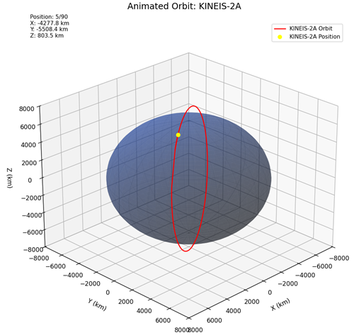

# Kinéis Satellite Orbit Visualizer

![Satellite Visualization Example] *(Example visualization)*

## Project Overview

This 3D visualization tool demonstrates the orbital paths of RocketLab-launched satellites operated by Kinéis, a company specializing in IoT connectivity solutions. The project focuses on their most recent satellite constellations (generations 2 and 4) that enable global IoT device communication.

## Key Features

- 🛰️ **Interactive 3D Visualization**: View satellite orbits around a realistically rendered Earth
- 📡 **10 Satellite Options**: Choose between Kinéis 2A-E and 4A-E satellites
- ⏱️ **90-Minute Simulation**: Shows complete orbital segments in near real-time
- 🌍 **Accurate Physics**: Uses SGP4 orbital propagation algorithms
- 📊 **Position Tracking**: Real-time coordinate display (X, Y, Z in kilometers)

## Technical Details

### Data Sources
- Uses current TLE (Two-Line Element) orbital data
- Satellites selected from Kinéis's most recent launches (2023-2024)

### Technologies
- Python 3.9+
- Key Libraries:
  - `matplotlib` for 3D visualization
  - `sgp4` for orbital calculations
  - `numpy` for mathematical operations

## How to Use

1. **Install requirements**:
   ```bash
   pip install matplotlib numpy sgp4

2. **Run the visualizer**:
    ```bash
    python main.py 

3. **Select a satellite when prompted (e.g., "2A" or "4D")**

4. **View the animation**:
    - Red line shows orbital path
    - Yellow dot shows current position
    - Earth is shown to scale (radius = 6371 km)

